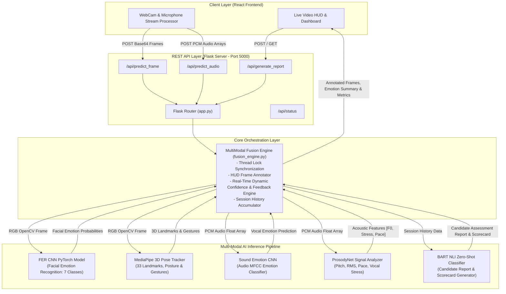

# HireVisor — AI Candidate Assessment System (Final Working Project)

HireVisor is an AI-powered human interview candidate assessment system. It combines multi-modal deep learning models (FER_CNN facial emotion recognition, MediaPipe 3D Pose & Body Language tracking, Sound Emotion CNN, ProsodyNet voice dynamics, and BART NLI candidate scorecard generation) connected via a Flask REST API backend to a React frontend.

---

## 🏗 System Architecture

HireVisor is designed around a modular **Multi-Modal Deep Learning & Real-Time Data Pipeline Architecture**. Below is an architectural overview of how client-side streams, API services, neural inferencing modules, fusion metrics, and candidate report synthesis interact.

### Architecture Diagram



### High-Level Architectural Flow

```text
+------------------------------------------------------------------------------------+
|                                CLIENT LAYER (React)                                |
|    +------------------------+                        +------------------------+    |
|    | Live Webcam Stream     |                        | Real-Time AI Dashboard |    |
|    | & Mic Signal Capturer  |                        | HUD Stats & Scorecard  |    |
|    +-----------+------------+                        +-----------^------------+    |
+----------------|-------------------------------------------------|-----------------+
                 | Base64 Frames / PCM Audio Array                 | Live Prediction JSON
                 v                                                 | (Annotated Frame, Stats)
+------------------------------------------------------------------|-----------------+
|                        FLASK REST API BACKEND (Port 5000)        |                 |
|                                                                  |                 |
|    +-------------------------------------------------------------+------------+    |
|    |               MULTIMODAL FUSION ENGINE (fusion_engine.py)               |    |
|    | - Thread-safe state synchronizer                                         |    |
|    | - Real-time metrics calculator (Eye Contact %, Dynamic Confidence)       |    |
|    | - Real-time OpenCV HUD badge & skeleton drawing                          |    |
|    +-------+--------------------+-------------------+--------------------+----+    |
|            |                    |                   |                    |         |
|            v                    v                   v                    v         |
|   +----------------+   +----------------+  +-----------------+  +----------------+ |
|   | FER CNN Model  |   | MediaPipe 3D   |  | Sound Emotion   |  | ProsodyNet     | |
|   | PyTorch Weight |   | Pose Tracker   |  | Audio CNN Model |  | Acoustic Engine| |
|   | (Facial Emotion|   | (Posture/Hands/|  | (Vocal Emotion  |  | (Pitch/Stress/ | |
|   |  7 Classes)    |   |  Fidgeting)    |  |  7 Classes)     |  |  Pace/Pause)   | |
|   +--------+-------+   +--------+-------+  +--------+--------+  +--------+-------+ |
|            |                    |                   |                    |         |
|            +--------------------+---------+---------+--------------------+         |
|                                           |                                        |
|                              Session History Aggregation                           |
|                                           v                                        |
|                        +-------------------------------------+                     |
|                        | BART Large NLI Zero-Shot Model      |                     |
|                        | Candidate Report & Scorecard Synthesizer|                 |
|                        +-------------------------------------+                     |
+------------------------------------------------------------------------------------+
```

### Component Details

1. **Frontend Presentation Layer (`frontend/`)**:
   - Built with **React** providing an interactive candidate interview portal.
   - Captures web camera frames encoded as JPEG Base64 and raw audio PCM arrays from browser media devices.
   - Receives annotated OpenCV video frames and live metrics (Eye Contact %, Voice Tone, Confidence Level, Emotion Distributions) to render real-time visual gauges.

2. **REST API Server Layer (`backend/app.py`)**:
   - Powered by **Flask** with cross-origin resource sharing (`flask-cors`) enabling async web client requests.
   - Exposes RESTful endpoints for frame predictions (`/api/predict_frame`), audio analysis (`/api/predict_audio`), combined multimodal stream processing (`/api/predict_multimodal`), and final report generation (`/api/generate_report`).

3. **Multimodal Fusion & State Engine (`backend/services/fusion_engine.py`)**:
   - Serves as the thread-safe central orchestrator using Python `threading.Lock`.
   - Normalizes and combines inputs across facial, pose, and acoustic neural sub-systems.
   - Computes weighted confidence scores, dynamic feedback prompts, and projects real-time skeletal & emotion HUD overlays directly onto video frames.
   - Maintains continuous candidate session logs to feed into downstream LLM/NLI transformers.

4. **Multi-Modal AI Inference Sub-systems (`backend/models/`)**:
   - **Facial Emotion Detector (`fer_model.py`)**: Fine-tuned PyTorch CNN classifying facial expressions across 7 emotional states (`Angry`, `Disgust`, `Fear`, `Happy`, `Neutral`, `Sad`, `Surprise`).
   - **3D Pose Tracker (`pose_model.py`)**: Utilizes MediaPipe Pose to track 33 spatial body landmarks, classifying postures (`Upright`, `Leaning Forward`, `Leaning Back`, `Slouched`) and hand gestures/fidgeting.
   - **Sound Emotion Classifier (`sound_model.py`)**: PyTorch deep audio classifier analyzing MFCC spectrogram features extracted from voice input.
   - **Prosody Signal Analyzer (`prosody_model.py`)**: Computes vocal dynamics including pitch frequency ($F_0$), RMS volume intensity, speech rate, pause frequency, and vocal stress indicators.
   - **BART NLI Scorecard Reporter (`bart_reporter.py`)**: Uses HuggingFace BART (`facebook/bart-large-mnli`) zero-shot classification to synthesize aggregated candidate session history into natural language behavioral reports, scoring competencies like Communication, Confidence, Stress Management, and Professional Demeanor.

---

##  Directory Structure (`Final_Project/`)

```text
Final_Project/
├── backend/
│   ├── app.py                 # Main Flask REST API server (Port 5000)
│   ├── config.py              # Configuration & model path resolver
│   ├── requirements.txt       # Backend dependencies
│   ├── test_backend.py        # Automated test verification script
│   ├── models/
│   │   ├── fer_model.py       # FER_CNN video facial emotion model
│   │   ├── sound_model.py     # Sound emotion CNN classifier
│   │   ├── prosody_model.py   # ProsodyNet audio metrics model
│   │   ├── pose_model.py      # MediaPipe 3D pose & gesture tracker
│   │   └── bart_reporter.py   # BART NLI zero-shot candidate reporter
│   └── services/
│       └── fusion_engine.py   # MultiModal fusion manager
│
├── frontend/
│   ├── src/
│   │   ├── components/
│   │   │   ├── StartInterview.js  # Live video AI analyzer & camera component
│   │   │   ├── Home.js           # Landing page
│   │   │   └── Navbar.js         # Navigation menu
│   │   ├── App.js
│   │   └── index.js
│   └── package.json
│
└── models_weights/
    ├── fer_model_finetuned_v2.pth
    ├── sound_emotion_model.pth
    └── prosody_net_best.pth
```

---

##  Quick Start Guide

### Step 1: Launch Flask AI Backend
Open a terminal in the `backend` folder:
```bash
cd backend
python app.py
```
*(The Flask backend will start on `http://127.0.0.1:5000`)*

### Step 2: Launch React Frontend
Open another terminal in the `frontend` folder:
```bash
cd frontend
npm start
```
*(The React frontend app will launch on `http://localhost:3000`)*

---

##  Testing Backend Server
To test all REST API endpoints and model loading:
```bash
cd backend
python test_backend.py
```
