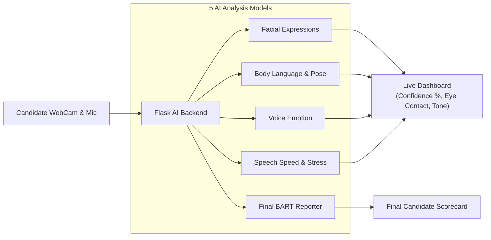

# HireVisor — AI Candidate Assessment System (Final Working Project)

HireVisor is an AI-powered human interview candidate assessment system. It combines multi-modal deep learning models (FER_CNN facial emotion recognition, MediaPipe 3D Pose & Body Language tracking, Sound Emotion CNN, ProsodyNet voice dynamics, and BART NLI candidate scorecard generation) connected via a Flask REST API backend to a React frontend.

---

## System Architecture

HireVisor works in **3 steps**:
1. **User Interface (React Frontend)** captures live video and audio from the candidate's camera and microphone.
2. **AI Server (Flask Backend)** runs **5 specialized AI models** in real-time to analyze video frames and voice signals.
3. **Multimodal Fusion Engine** combines all model outputs into live dashboard metrics (Confidence %, Eye Contact, Voice Tone) and generates a final candidate scorecard.

---

### How Data Flows Through HireVisor



---

### Core Components Explained

| Component | Built With | Explanation |
| :--- | :--- | :--- |
| **Frontend UI** | React.js | Interactive candidate portal displaying the live webcam feed, real-time emotion meters, posture tips, and feedback. |
| **Backend Server** | Flask (Python) | The backend server (`app.py`) that accepts video frames & audio arrays and routes them to the AI models. |
| **Fusion Engine** | Python (`fusion_engine.py`) | The orchestrator that blends face, pose, and voice data to calculate candidate confidence scores and HUD overlays. |

---

### The 5 AI Models Inside HireVisor

1. **Facial Emotion Detector (`fer_model.py`)**: PyTorch deep learning model that reads face expressions (Happy, Neutral, Fear/Nervous, Sad, Angry, Disgust, Surprise).
2. **Body Posture & Gesture Tracker (`pose_model.py`)**: MediaPipe 3D body tracking that checks posture (Upright vs. Slouched), hand gestures, head movement, and fidgeting.
3. **Sound Emotion Classifier (`sound_model.py`)**: Audio neural network that predicts emotional tone directly from microphone audio.
4. **Speech Dynamics Analyzer (`prosody_model.py`)**: Measures pitch ($F_0$), speaking tempo, pause frequency, and vocal stress level.
5. **AI Report Generator (`bart_reporter.py`)**: HuggingFace BART NLI transformer model that synthesizes session history into a structured candidate assessment report and scorecard.

---

##  Directory Structure (`Final_Project/`)

```text
Final_Project/
├── backend/
│   ├── app.py                 # Main Flask REST API server (Port 5000)
│   ├── config.py              # Configuration & model path resolver
│   ├── requirements.txt       # Backend dependencies
│   ├── test_backend.py        # Automated test verification script
│   ├── models/
│   │   ├── fer_model.py       # FER_CNN video facial emotion model
│   │   ├── sound_model.py     # Sound emotion CNN classifier
│   │   ├── prosody_model.py   # ProsodyNet audio metrics model
│   │   ├── pose_model.py      # MediaPipe 3D pose & gesture tracker
│   │   └── bart_reporter.py   # BART NLI zero-shot candidate reporter
│   └── services/
│       └── fusion_engine.py   # MultiModal fusion manager
│
├── frontend/
│   ├── src/
│   │   ├── components/
│   │   │   ├── StartInterview.js  # Live video AI analyzer & camera component
│   │   │   ├── Home.js           # Landing page
│   │   │   └── Navbar.js         # Navigation menu
│   │   ├── App.js
│   │   └── index.js
│   └── package.json
│
└── models_weights/
    ├── fer_model_finetuned_v2.pth
    ├── sound_emotion_model.pth
    └── prosody_net_best.pth
```

---

##  Quick Start Guide

### Step 1: Launch Flask AI Backend
Open a terminal in the `backend` folder:
```bash
cd backend
python app.py
```
*(The Flask backend will start on `http://127.0.0.1:5000`)*

### Step 2: Launch React Frontend
Open another terminal in the `frontend` folder:
```bash
cd frontend
npm start
```
*(The React frontend app will launch on `http://localhost:3000`)*

---

##  Testing Backend Server
To test all REST API endpoints and model loading:
```bash
cd backend
python test_backend.py
```
